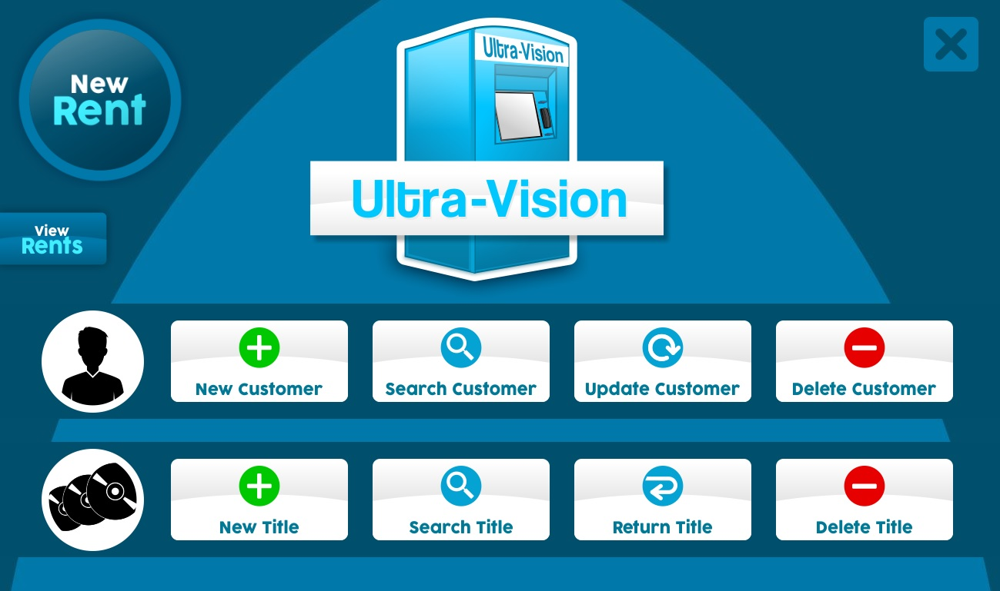

# Ultra-Vision

Music, Live Concert, Movies and Box Sets Renting System

This is a Point of Sale system written in java language with integrated GUI Java swing and SQL Database. The project was built using the Model-View-Controller(MVC) architectural pattern for better safety and encapsulation.

## Contributors

- Everson Spinola <everson_spinola@hotmail.com>

## Database Creation
- check out the file "Database Script" that contains the script to create the whole SQL schema so the application can store and retrieve data.
